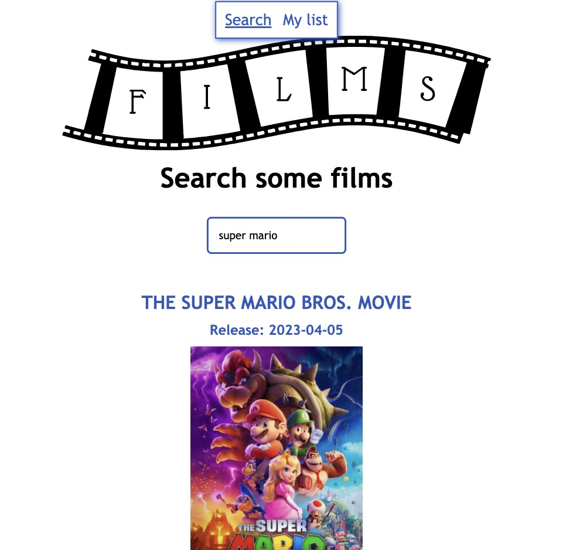
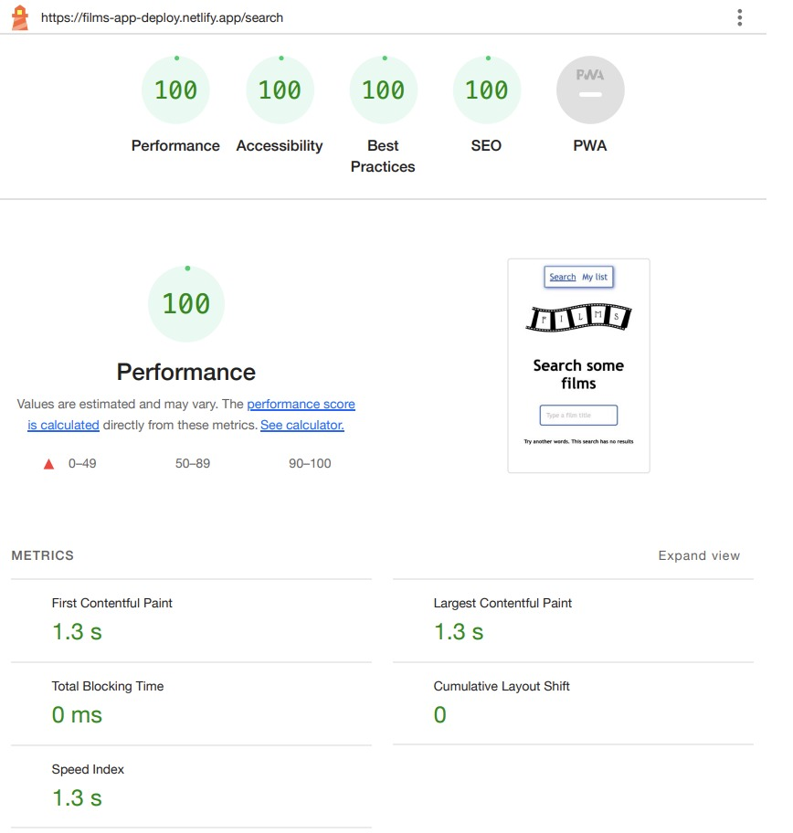

# **Films**

Films app. Show a list of films filtered by searched title. User can rate, comment and see the list of its rated films.

[Live Site](https://films-app-deploy.netlify.app/)

 

# Starting the app

1. `npm install`

2. Rename the file `_env-sample` to `.env` and write the API key inside.

3. `npm run dev`

 

# Built with

🔸[Typescript](https://www.typescriptlang.org/docs/)  
🔸[React](https://es.react.dev/)  
🔸[Redux-Toolkit](https://redux.js.org/)  
🔸[Styled-components](https://styled-components.com/)  
🔸[Axios](https://axios-http.com/docs/intro)  
 

# Testing

🔸[React Testing Library](https://testing-library.com/)  
🔸[Vitest](https://vitest.dev/)  
🔸[Mock Service Worker](https://mswjs.io/)  
 

# Good Practices Tools

🔸[Husky hooks](https://typicode.github.io/husky/)  
🔸[Eslint](https://eslint.org/)  
🔸[Prettier](https://prettier.io/)  
🔸[SonarCloud](https://www.sonarsource.com/products/sonarcloud/)

 

# Performance

